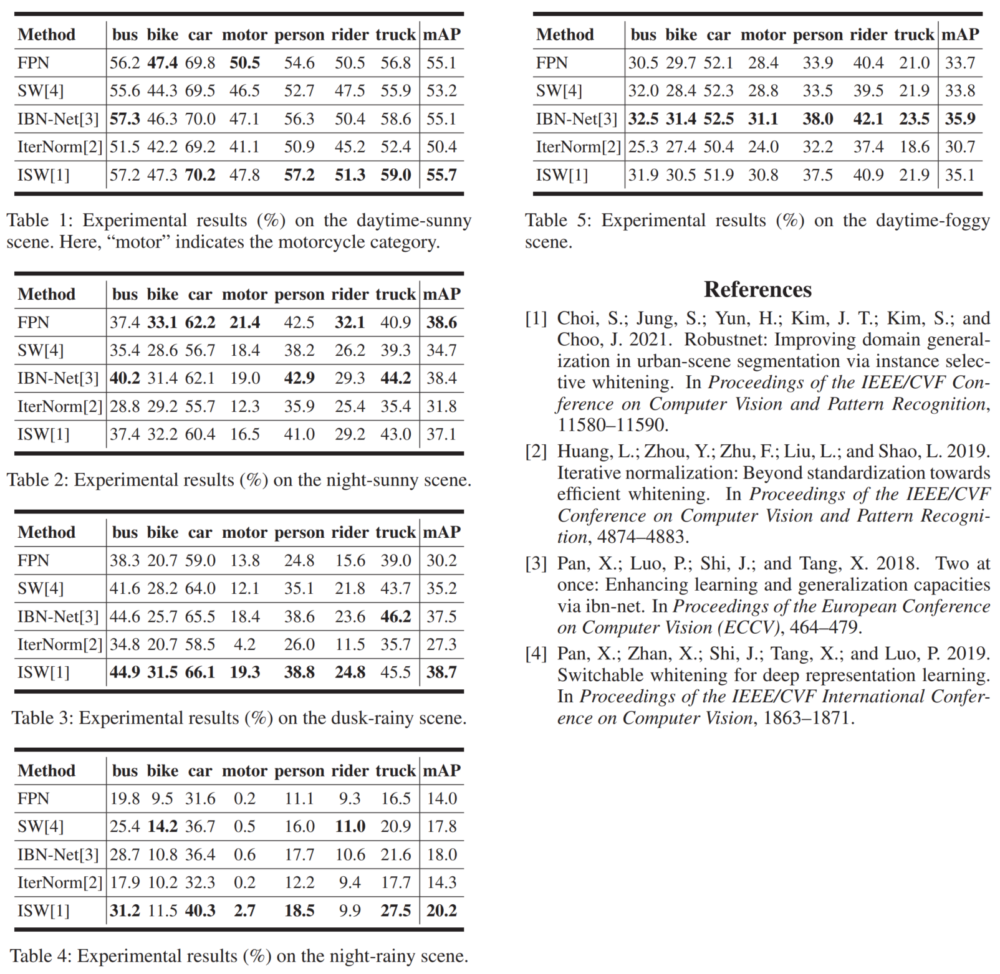

# Single-Domain Generalized Object Detection

CVPR2022: Single-Domain Generalized Object Detection in Urban Scene via Cyclic-Disentangled Self-Distillation.

The current code is Faster R-CNN with FPN. In our paper, we do not utilize FPN.

### Datasets

#### Daytime-Sunny, Night-Sunny, Dusk-Rainy, Night-Rainy, and Daytime-Foggy

[[Download link](https://drive.google.com/drive/folders/1IIUnUrJrvFgPzU8D6KtV0CXa8k1eBV9B)]

[[models](https://drive.google.com/drive/folders/1CahYwJN6LBbJNY2XqslrFEHxqY6JDhZn)]

## Training

CUDA_VISIBLE_DEVICES=$GPU_ID python trainval_net_fpn.py \
                    --dataset dc_fpn --net res101 --epochs 20 \
                    --bs 2 --nw 8 \
                    --lr 0.004 --lr_decay_step 8 \
                    --cuda

## Evaluation

CUDA_VISIBLE_DEVICES=$GPU_ID python test_net_fpn.py --dataset dc_fpn --dataset_test voc_2007_train_nightclear --net res101 \
                   --checksession 1 --checkepoch 10 --checkpoint 19317 \
                   --cuda

## New Results

